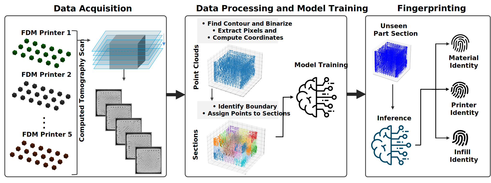
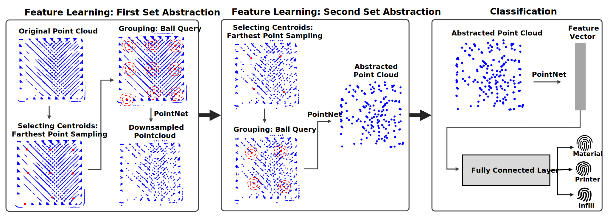

# Additive Manufacturing Source Identification from Internal Void Structures using X-Ray Computed Tomography and Point Cloud Deep Learning

This repository contains the data-processing and deep learning pipeline used in the paper *"Additive Manufacturing Source Identification from Internal Void Structures using X-Ray Computed Tomography and Point Cloud Deep Learning."* The pipeline converts X-ray CT scans of 3D-printed parts into 3D point clouds representing internal void (porosity) structures, then trains an optimized PointNet++-based classifier to identify the printer that produced a given part from those void structures, which is a form of "fingerprinting" based on machine-specific internal signatures.

## Overview

Every additive manufacturing (AM) machine leaves subtle, characteristic signatures in the internal void structure of the parts it prints. This project:

1. Extracts internal void point clouds from CT image slices of printed cube samples (`pointcloud_generation.ipynb`)
2. Subdivides the point cloud of each part into smaller spatial sections for data augmentation (also in `pointcloud_generation.ipynb`)
3. Trains a PointNet++-based (MSG) classification network to predict the source printer from a void point cloud (`pcd_train.py`, `model.py`, `pointnet2_utils.py`)



## Repository Structure

```
.
├── pointcloud_generation.ipynb   # CT images -> point cloud HDF5, then sectioning/shaving
├── pcd_train.py                  # Main training script (data loading, split, train/eval loop)
├── model.py                      # PointNet++ and related model architectures
├── pointnet2_utils.py            # PointNet++ set abstraction / grouping / sampling utilities
└── README.md
```

## Dataset

A representative subset (90 cube samples) of the full study dataset is publicly available on Kaggle:

**[Point Cloud Fingerprint Representative Dataset](https://www.kaggle.com/datasets/astroasif/point-cloud-fingerprint-representative-dataset/versions/2)**

It includes:
- Raw CT image slices (`.tif`) for each cube sample
- A pre-generated point cloud HDF5 file containing the sectioned void point clouds used for training

### Sample Identifier Convention

Each sample is labeled with a 5-character alphanumeric identifier, e.g. `1AA1A`, where each position encodes:

| Position | Meaning | Values |
|---|---|---|
| 1 | Printer number | `1`, `2`, `3`, `4`, `5` |
| 2 | Material | `A` = PLA, `B` = PC |
| 3 | Infill density | `A` = 100%, `C` = 98%, `E` = 96% |
| 4 | Repeat number | `1`, `2`, `3` |
| 5 | Part design | `A` = cube |

In `pcd_train.py`, class labels for printer-source classification are derived from **position 1** of the identifier (`GROUP_CHAR_INDEX = 0`, `GROUP_VALUES = ['1','2','3','4','5']`), so the model is trained to classify which of the 5 printers produced a given void point cloud.

## Pipeline

### 1. Point Cloud Generation (`pointcloud_generation.ipynb`)

This notebook has two stages:

**Stage A: CT images → raw void point clouds (HDF5)**
- Reads stacks of `.tif` CT slice images per part
- Thresholds each slice (Otsu) and extracts either internal void or solid contours, controlled by `EXTRACT_MODE`
- Converts pixel coordinates to physical micron coordinates using the XY/Z voxel resolution for the scan
- Groups slices into fixed-size chunks (`CHUNK_SIZE`, default 540 slices to capture the full part height) per part and writes each chunk as a dataset in an output `.h5` file, keyed as `{part}_chunk{n}`
- Processing is parallelized across parts with `joblib`

**Stage B: Sectioning and edge shaving**
- Loads the chunked HDF5 file from Stage A
- Optionally "shaves" a percentage of the XY extent from each chunk's bounding box to remove edge/wall artifacts (`XY_SHAVE_FRAC`)
- Subdivides the point cloud of each chunk into a 3D grid of smaller spatial sections (`DIVS_X`, `DIVS_Y`, `DIVS_Z`), increasing the number of training samples and localizing void patterns spatially
- Writes the final sectioned point clouds to a new HDF5 file (this is the file consumed by `pcd_train.py`)
- Optionally saves 3D scatter plot visualizations of the original vs. sectioned point cloud for a chosen sample

> **Note:** File paths inside the notebook (`BASE_DIRECTORY`, `HDF5_PATH`, `INPUT_H5`, `OUTPUT_H5`) are set to the original local paths used during the study and must be updated to point to your own downloaded CT images / HDF5 files.

### 2. Model Training (`pcd_train.py`, `model.py`, `pointnet2_utils.py`)

`pcd_train.py` is the main entry point:

- Loads all point cloud chunks from the sectioned HDF5 file, normalizes each (centers on centroid, scales to unit max-norm), and resamples each to a fixed number of points (`target_points`)
- Groups chunks by sample identifier, then splits **per class group** into train/validation sets (`VAL_RATIO`), so identifiers (not individual chunks) are held out for validation to avoid leakage across sections of the same physical part
- Assigns class labels based on `GROUP_CHAR_INDEX` / `GROUP_VALUES` (by default, the printer number)
- Trains an optimized `PointNet2Cls_51` or `PointNet2Cls_59` (PointNet++ multi-scale grouping classifier, defined in `model.py`) using cross-entropy loss, Adam, mixed-precision (`torch.amp`), and a `ReduceLROnPlateau` scheduler
- Logs metrics (loss, per-class accuracy, confusion matrix) to [Weights & Biases](https://wandb.ai/)
- Saves a CSV of true/predicted labels for the best validation epoch

`model.py` contains several architectures built on the PointNet++ building blocks in `pointnet2_utils.py`:
- `PointNet2Cls` / `PointNet2Cls_51` / `PointNet2Cls_59`: PointNet++ classification heads (the latter two are optimized architecture that uses tighter grouping radii/sample counts tuned for the characteristic length scale of the "fingeprints")
- `PointCloudAE`, `PointNet2AE`: autoencoder variants for unsupervised feature learning
- `PointNet2Reg`: regression head variant

`pointnet2_utils.py` implements the core PointNet++ operations: farthest point sampling, ball query grouping, set abstraction (single-scale and multi-scale/MSG), and feature propagation, adapted from the original [PointNet++ (Qi et al.)](https://github.com/charlesq34/pointnet2) implementation.



## Requirements

```
torch
numpy
pandas
h5py
wandb
opencv-python
Pillow
joblib
matplotlib
```

A CUDA-capable GPU is strongly recommended for training; the script supports multi-GPU training via `nn.DataParallel` if more than one GPU is available.

## Usage

1. **Download the dataset** from [Kaggle](https://www.kaggle.com/datasets/astroasif/point-cloud-fingerprint-representative-dataset/versions/2).
2. **(Optional) Regenerate point clouds from raw CT images** using `pointcloud_generation.ipynb`: update the path variables at the top of each stage to point to your local CT image directory and desired output HDF5 paths. This step can be skipped if you use the pre-generated point cloud HDF5 file provided in the dataset.
3. **Configure training** in `pcd_train.py`:
   - Set `HDF5_PATH` to the location of your sectioned point cloud `.h5` file
   - Update the `wandb.init(...)` call with your own W&B `entity`/`project`, or disable W&B logging
   - Adjust `GROUP_VALUES` / `GROUP_CHAR_INDEX` if you want to classify by a different identifier position (e.g. material or infill instead of printer)
   - Adjust `batch_size` parameter based on available GPU VRAM
4. **Run training:**
   ```bash
   python pcd_train.py
   ```

## Citation

If you use this code or dataset, please cite:

> *Additive Manufacturing Source Identification from Internal Void Structures using X-Ray Computed Tomography and Point Cloud Deep Learning*

(Full citation details to be added upon publication.)

## Acknowledgments

PointNet++ components adapted from the original PointNet++ implementation by Qi et al.
